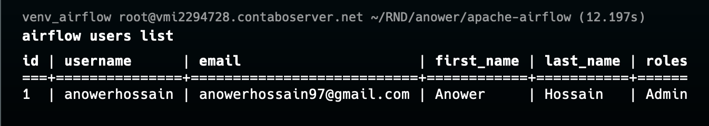

# Extract-Load-Transform-and-Notify-using-Airflow
Automating data extraction, transformation, and delivery across systems 🌐, ensuring seamless data integration, analysis, and timely reporting 📊, while notifying stakeholders via email 📧 to make data-driven decisions faster and more efficiently.


### Step : 1- Apache Airflow Setup 🚀

- Install Airflow via pip:
You can install Apache Airflow using `pip`
```bash
pip install apache-airflow
```

- Check the Airflow Version
```bash
airflow version
```

- Verify airflow commands
```bash
airflow info
```

- Initialize Airflow:
Apache Airflow uses a metadata database. By default, it uses SQLite.
```bash
  airflow db init
```

- Add users in Apache Airflow
```bash
airflow users create \
  --username anowerhossain \
  --firstname Anower \
  --lastname Hossain \
  --email anowerhossain97@gmail.com \
  --role Admin \
  --password "newpassword"
```
- To verify users is added run

```bash
airflow users list
```
 


- Start Airflow web server and scheduler:
```bash
airflow webserver -p 8080 
airflow scheduler
```

- Start Airflow web server and scheduler in background process with log file:
```bash
nohup airflow webserver -p 8080 > airflow-webserver.log 2>&1 &
nohup airflow scheduler > airflow-scheduler.log 2>&1 &
```

- Allow Remote Server's Firewall for port 8080
```bash
sudo firewall-cmd --zone=public --add-port=8080/tcp --permanent
sudo firewall-cmd --reload
```

- Open Browser and Access the Airflow UI at `http://161.97.ANO.WER:8080`

- Change the DAGs directory from `airflow.cnf` file

```bash
airflow config get-value core dags_folder
```
This will show the default dag directory. To change the default go to `airflow.cnf` and set `dag_folder` = /root/RND/anower/apache-airflow/anower_dags and save it. To apply changes restart the airflow services.

- Restart Airflow web server and scheduler in background process with log file:
```bash
nohup airflow webserver -p 8080 > airflow-webserver.log 2>&1 &
nohup airflow scheduler > airflow-scheduler.log 2>&1 &
```


